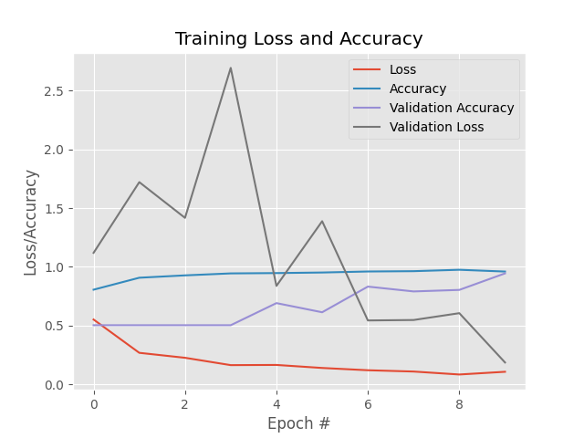

# Face Detection #

## Introduction ##
The project is to detection a gender face recognition i.e., Male or Female. Here, we can use to create a model with the help of Deep Learning model by Python library (i.e., Tensorflow).

## Files ##
- **dmw.py:** We can use to import dataset, split it, train it, test it, and result it. In addition save a model file to **gender_detection.model** folder.
- **dmw_face.py:** In a real-world camera environment, a face detection is showing.
- **modelsummary.txt**: It shows a model for training.

## Aug v/s non-Aug ##
**What is Data Augmentation?** Data Augmentation is a technique used to artificially increase dataset size. Take a sample from the dataset, modify it somehow, add it to the original dataset.

Here, show a plot as shown below:
- **Aug**

- **non-Aug**

[Click the poster presentation](https://docs.google.com/presentation/d/1qwLPPaMutRK1Zn8L5Qt85-uYC0jC249vVazbBrm7UY8/edit?usp=sharing)
